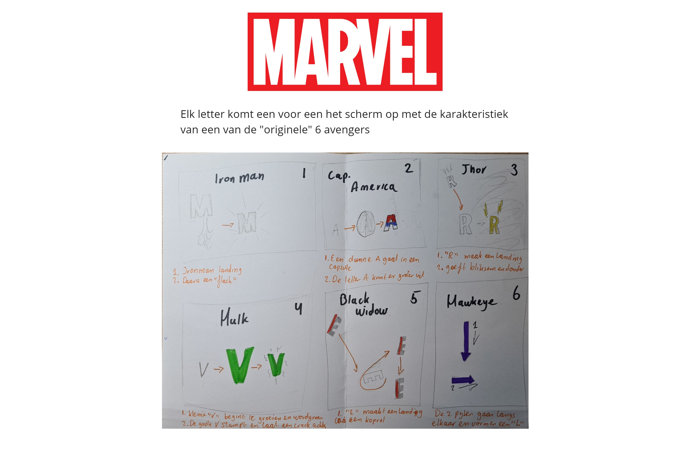

# Procesverslag
**Auteur:** Ymaro Blue

**De opdrachten:** [opdracht 1](opdracht1/index.html) en [opdracht 2](opdracht2/index.html)

Markdown is een simpele manier om HTML te schrijven.  
Markdown cheat cheet: [Hulp bij het schrijven van Markdown](https://github.com/adam-p/markdown-here/wiki/Markdown-Cheatsheet).

Nb. De standaardstructuur en de spartaanse opmaak van de README.md zijn helemaal prima. Het gaat om de inhoud van je procesverslag. Besteedt de tijd voor pracht en praal aan je website.

Nb. Door *open* toe te voegen aan een *details* element kun je deze standaard open zetten. Fijn om dat steeds voor de relevante stuk(ken) te doen.

## Bronnenlijst
  - https://www.youtube.com/watch?v=Noooxfq6RE0 (Ironman)
  - https://www.youtube.com/watch?v=MxKR_wnkZpU (Ironman)
  - https://www.youtube.com/watch?v=XzDnsn4NWwE (Captain America)
  - https://www.youtube.com/watch?v=d4Dsh8lt0hs (Thor)
  - https://www.youtube.com/watch?v=2Vfu_VKYZEQ&t=1s (Hulk)
  - https://www.youtube.com/watch?v=cVFsoBMkpGk (Black Widow)
  - https://www.youtube.com/watch?v=r3pAgUdcU9c (Hawkeye)
  - https://www.digitalspy.com/movies/a26593301/avengers-endgame-actors-samuel-l-jackson-hints-nick-fury/

## Opdracht 1 plan

  
uitwerken na schetsen idee (voor week 2)

  ### Je storyboard:
  

  ### Storyboard aanpassing:
  In plaats van dat de "A", captain america, in een capsule gaat, bouncet hij langs de "muren" net zoals zijn schild dat hij gebruikt. Deze keuze heb ik gemaakt omdat de 1e versie van zijn animation meer zijn geschiedenis was ipv zijn karaktereigenschap, net zoals bij de rest van de letters.

  ### Je ambitie: 
  Aan deze technieken/punten wil ik werken:
  - Transition met kleuren
  - Letters "stretchen"
  - Spelem met perspectief
  - Geluid timing
  
 

## Opdracht 1 reflectie

  
uitwerken bij afronden opdracht (voor week 3)

  ### Je uitkomst - karakteristiek screenshot(s):
  

  ### Dit ging goed/Heb ik geleerd: 
  Korte omschrijving met plaatje(s)

  

  ### Dit was lastig/Is niet gelukt:
  Korte omschrijving met plaatje(s)

  

## Opdracht 2 plan

  
uitwerken na schetsen idee (voor week 4)

  ### Je ontwerp:
  

  ### Je ambitie: 
  Aan deze technieken/punten wil ik werken:
  - punt 1
  - punt 2
  - nog een punt
  - ...

## Opdracht 2 test

  
uitwerken na testen (week 6/7)

  Neem minimaal 5 bevindingen op:

  ### Bevinding 1:
  Omschrijving van wat er nog niet orde was (tekst en afbeeding(en)).

  #### oplossing:
  Beschrijving hoe je het hebt hebt opgelost of als het niet gelukt is hoe je het zou oplossen (tekst en afbeeding(en)).

  ### Bevinding 2:
  Omschrijving van wat er nog niet orde was (tekst en afbeeding(en)).

  #### oplossing:
  Beschrijving hoe je het hebt hebt opgelost of als het niet gelukt is hoe je het zou oplossen (tekst en afbeeding(en)).

  ### Bevinding 3:
  ...

## Opdracht 2 reflectie

  
uitwerken bij afronden opdracht (voor week 8)

  ### Je uitkomst - karakteristiek screenshot(s):
  

  ### Dit ging goed/Heb ik geleerd: 
  Korte omschrijving met plaatje(s)

  

  ### Dit was lastig/Is niet gelukt:
  Korte omschrijving met plaatje(s)

  

