# Procesverslag
**Auteur:** Ymaro Blue

**De opdrachten:** [opdracht 1](opdracht1/index.html) en [opdracht 2](opdracht2/index.html)

Markdown is een simpele manier om HTML te schrijven.  
Markdown cheat cheet: [Hulp bij het schrijven van Markdown](https://github.com/adam-p/markdown-here/wiki/Markdown-Cheatsheet).

Nb. De standaardstructuur en de spartaanse opmaak van de README.md zijn helemaal prima. Het gaat om de inhoud van je procesverslag. Besteedt de tijd voor pracht en praal aan je website.

Nb. Door *open* toe te voegen aan een *details* element kun je deze standaard open zetten. Fijn om dat steeds voor de relevante stuk(ken) te doen.

## Bronnenlijst opdracht 1
  - https://www.youtube.com/watch?v=Noooxfq6RE0 (Ironman)
  - https://www.youtube.com/watch?v=MxKR_wnkZpU (Ironman)
  - https://www.youtube.com/watch?v=XzDnsn4NWwE (Captain America)
  - https://www.youtube.com/watch?v=d4Dsh8lt0hs (Thor)
  - https://www.youtube.com/watch?v=2Vfu_VKYZEQ&t=1s (Hulk)
  - https://www.youtube.com/watch?v=cVFsoBMkpGk (Black Widow)
  - https://www.youtube.com/watch?v=r3pAgUdcU9c (Hawkeye)
  - https://www.digitalspy.com/movies/a26593301/avengers-endgame-actors-samuel-l-jackson-hints-nick-fury/
  - https://codepen.io/shooft/pen/rNYJWJw (Captain America, Hawkeye)

## Bronnenlijst opdracht 2
  - https://stackoverflow.com/questions/17386168/how-to-create-a-heart-shape-using-css (Heartshape)

## Opdracht 1 plan

  
uitwerken na schetsen idee (voor week 2)

  ### Je storyboard:
  

  ### Storyboard aanpassing:
  In plaats van dat de "A", captain america, in een capsule gaat, bouncet hij langs de "muren" net zoals zijn schild dat hij gebruikt. Deze keuze heb ik gemaakt omdat de 1e versie van zijn animation meer zijn geschiedenis was ipv zijn karaktereigenschap, net zoals bij de rest van de letters.

  ### Je ambitie: 
  Aan deze technieken/punten wil ik werken:
  - Transition met kleuren
  - Letters "stretchen"
  - Spelen met perspectief
  - Geluid timing
  
 

## Opdracht 1 reflectie

  
uitwerken bij afronden opdracht (voor week 3)

  ### Je uitkomst - karakteristiek screenshot(s):
  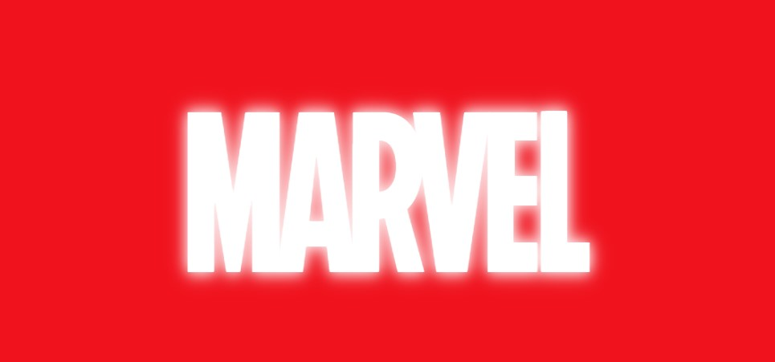

  ### Dit ging goed/Heb ik geleerd: 
  Het verplaasten van letter naar bepaalde posities vond ik goed gaan. Ook precies op timing. Dit kan ik niet laten zien in foto's, maar dit is wel terug te zien in de animatie. Verder heb ik geleerd over perspectief(3d) en heb ik dit ook toe kunnen passen op de Hawkeye animatie(Letter L).
  Bij mijn animatie komen de letter 1 voor 1 in beeld met bijpassend geluid, wanneer er wordt gekozen om de animatie af te spelen op het introscherm.

  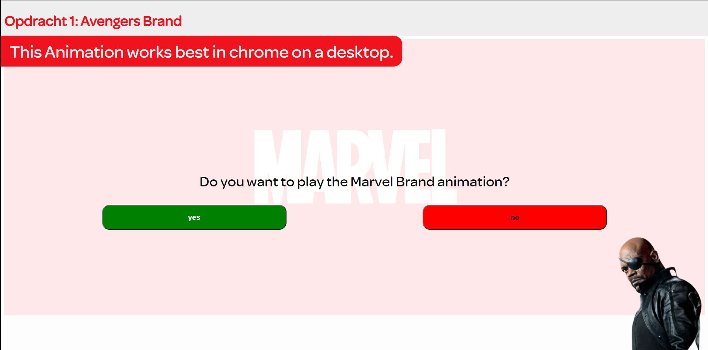
  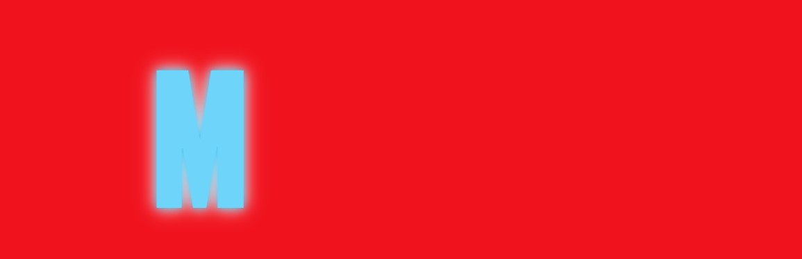
  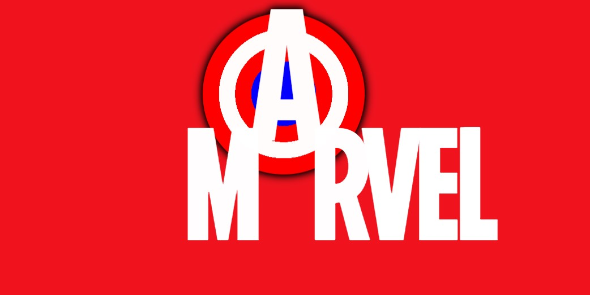
  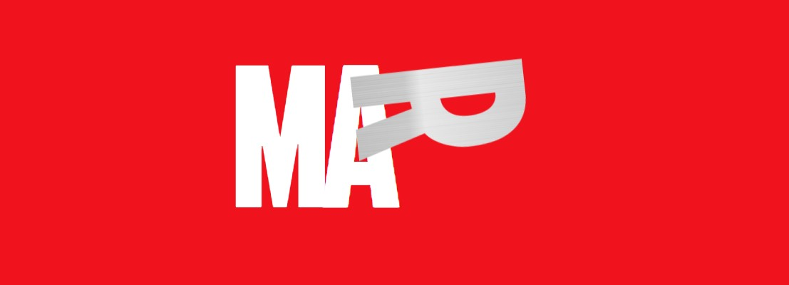
  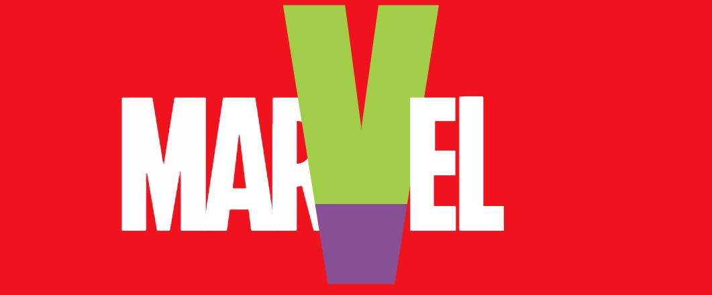
  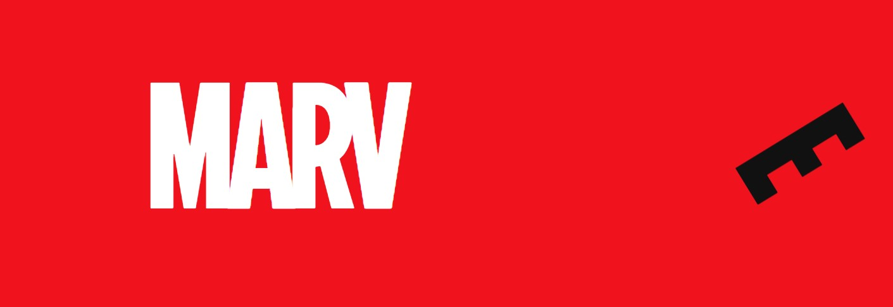
  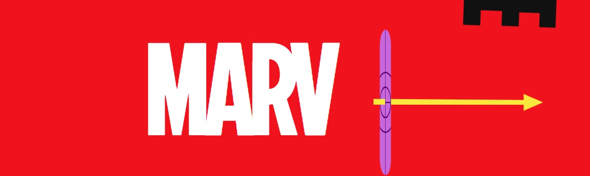

  ### Dit was lastig/Is niet gelukt:
  Er was niet echt iets dat mij niet lukte. Alles wat ik probeerde toe te passen lukte mij wel. Ik heb alleen een issue op de kleinere schermen en mac/ios. De letters r en v afgesneden wordt aan de zijkant op kleine schermen en op de mac/ios lopen sommige animaties niet helemaal goed. Dit is mij ook helaas niet gelukt om te fixen.

  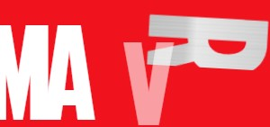
  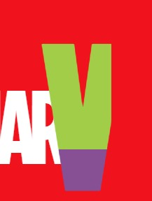

## Opdracht 2 plan

  
uitwerken na schetsen idee (voor week 4)

  ### Je ontwerp:
  

  ### Je ambitie: 
  Aan deze technieken/punten wil ik werken:
  - microinteracties na een bepaalde triggers
  - Heel "DRY" werken
  - Goede responsive layout/columns
  - Goed gebruik maken van localStorage
  - Filteren op de api lijst

## Opdracht 2 reflectie

  
uitwerken bij afronden opdracht (voor week 8)

  ### Je uitkomst - karakteristiek screenshot(s):
  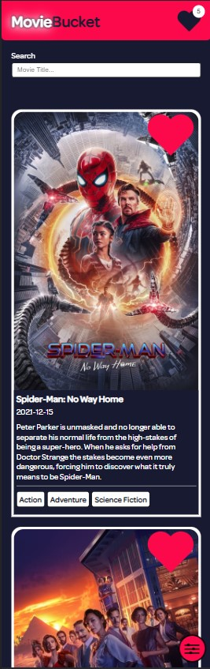
  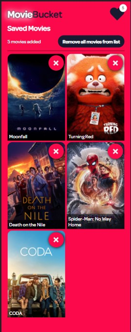
  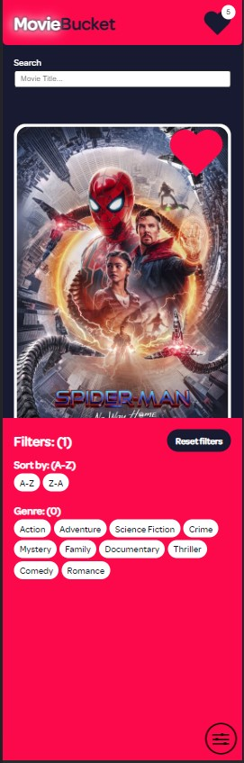

  ### Dit ging goed/Heb ik geleerd: 
  Wat goed ging is het gebruik van de localStorage om films en zelfs ook filters in op te slaan. De localstorage wordt ook gebruikt om te kijken of je de savedMoves section open had staan of niet, zodat na het refreshen hij ook open is.

  

  Wat ik ook leuk vond zijn de scroll events. De "scroll to top" button is alleen zichtbaar als er naar beneden wordt gescrolld

  
  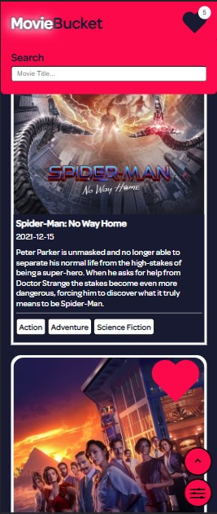

  Als laatst vond ik mijn microinteracties wel leuk om te maken en vind ik ook dat zij goed gelukt zijn. Dit is alleen lastig om te zien, omdat dit bewegende beelden zijn.

  ### Dit was lastig/Is niet gelukt:
  Wat ik lastig vond om te doen is het werkend krijgen van sorteren/filteren door het gebruik van de api. Deze api was niet zo goed op het gebied van params doorgeven zoals genres. Dit moest ik dus allemaal handmatig schrijven en werkt eigenlijk alleen op de al geladen films en niet op de films die nog gelazyload moeten worden.

  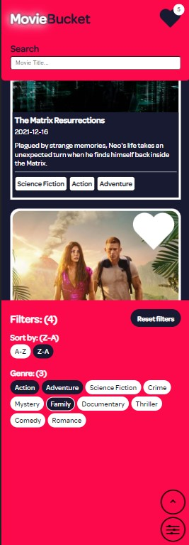

